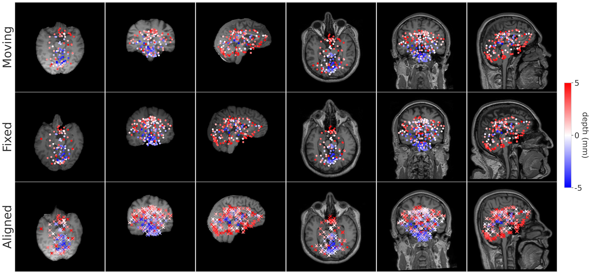

# BrainMorph: A Foundational Keypoint Model for Robust and Flexible Brain MRI Registration


BrainMorph is a foundation model for brain MRI registration.
It is a deep learning-based model trained on over 100,000 brain MR images at full resolution (256x256x256).
The model is robust to normal and diseased brains, a variety of MRI modalities, and skullstripped and non-skullstripped images.
It supports unimodal/multimodal pairwise and groupwise registration using rigid, affine, or nonlinear transformations.



BrainMorph is built on top of the [KeyMorph framework](https://github.com/alanqrwang/keymorph), a deep learning-based image registration framework that relies on automatically extracting corresponding keypoints. 

Check out the [colab tutorial](https://colab.research.google.com/drive/1w_vKuSziY6EJhBnjwLnaWO6GOtZ8HjDP?usp=sharing) to get started!

## Updates
- [May 2024] The preprint for BrainMorph is available on [arXiv](https://arxiv.org/abs/2405.14019)!
- [May 2024] Released full set of BrainMorph models on [Box](https://cornell.box.com/s/2mw4ey1u7waqrpylnxf49rck7u3nnr7i). Usage instructions under "Registering brain volumes" (paper to come!).

## Installation
```bash
git clone https://github.com/alanqrwang/brainmorph.git
cd brainmorph
pip install -e .
```

### Requirements
The brainmorph package depends on the following requirements:

- keymorph>=1.0.0
- numpy>=1.19.1
- ogb>=1.2.6
- outdated>=0.2.0
- pandas>=1.1.0
- pytz>=2020.4
- torch>=1.7.0
- torchvision>=0.8.2
- scikit-learn>=0.20.0
- scipy>=1.5.4
- torchio>=0.19.6

Running `pip install -e .` will automatically check for and install all of these requirements.

## Downloading Trained Weights
The ``--download`` flag in the provided script will automatically download the corresponding model and place is in the folder specified by `--weights_dir` (see below commands).
Otherwise, you can find all BrainMorph trained weights [here](https://cornell.box.com/s/2mw4ey1u7waqrpylnxf49rck7u3nnr7i) and manually place them in the folder specified by `--weights_dir`.

## Registering brain volumes 
To get started, check out the [colab tutorial](https://colab.research.google.com/drive/1w_vKuSziY6EJhBnjwLnaWO6GOtZ8HjDP?usp=sharing)!

### Pairwise registration
The script will automatically min-max normalize the images and resample to 1mm isotropic resolution.

`--num_keypoints` and `--variant` will determine which model will be used to perform the registration.
<!-- Make sure the corresponding weights are present in `--weights_dir`. -->
`--num_keypoints` can be set to `128, 256, 512` and `--variant` can be set to `S, M, L` (corresponding to model size).

To register a single pair of volumes:
```
python scripts/register.py \
    --num_keypoints 256 \
    --variant S \
    --weights_dir ./weights/ \
    --moving ./example_data/img_m/IXI_000001_0000.nii.gz \
    --fixed ./example_data/img_m/IXI_000002_0000.nii.gz \
    --moving_seg ./example_data/seg_m/IXI_000001_0000.nii.gz \
    --fixed_seg ./example_data/seg_m/IXI_000002_0000.nii.gz \
    --list_of_aligns rigid affine tps_1 \
    --list_of_metrics mse harddice \
    --save_eval_to_disk \
    --save_dir ./register_output/ \
    --visualize \
    --download
```

Description of other important flags:
+ `--moving` and `--fixed` are paths to moving and fixed images.
+ `--moving_seg` and `--fixed_seg` are paths to moving and fixed segmentation maps. These are optional, but are required if you want the script to report Dice scores or surface distances. 
+ `--list_of_aligns` specifies the types of alignment to perform. Options are `rigid`, `affine` and `tps_<lambda>` (TPS with hyperparameter value equal to lambda). lambda=0 corresponds to exact keypoint alignment. lambda=10 is very similar to affine.
+ `--list_of_metrics` specifies the metrics to report. Options are `mse`, `harddice`, `softdice`, `hausd`, `jdstd`, `jdlessthan0`. To compute Dice scores and surface distances, `--moving_seg` and `--fixed_seg` must be provided.
+ `--save_eval_to_disk` saves all outputs to disk. 
+ `--save_dir` specifies the folder where outputs will be saved. The default location is `./register_output/`.
+ `--visualize` plots a matplotlib figure of moving, fixed, and registered images overlaid with corresponding points.
+ `--download` downloads the corresponding model weights automatically if not present in `--weights_dir`.

You can also replace filenames with directories to register all pairs of images in the directories.
Note that the script expects corresponding image and segmentation pairs to have the same filename.
```bash
python scripts/register.py \
    --num_keypoints 256 \
    --variant S \
    --weights_dir ./weights/ \
    --moving ./example_data/img_m/ \
    --fixed ./example_data/img_m/ \
    --moving_seg ./example_data/seg_m/ \
    --fixed_seg ./example_data/seg_m/ \
    --list_of_aligns rigid affine tps_1 \
    --list_of_metrics mse harddice \
    --save_eval_to_disk \
    --save_dir ./register_output/ \
    --visualize \
    --download
```

### Groupwise registration
To register a group of volumes, put the volumes in `./example_data/img_m`. If segmentations are available, put them in `./example_data/seg_m`. Then run:
```bash
python scripts/register.py \
    --groupwise \
    --num_keypoints 256 \
    --variant S \
    --weights_dir ./weights/ \
    --moving ./example_data/ \
    --fixed ./example_data/ \
    --moving_seg ./example_data/ \
    --fixed_seg ./example_data/ \
    --list_of_aligns rigid affine tps_1 \
    --list_of_metrics mse harddice \
    --save_eval_to_disk \
    --save_dir ./register_output/ \
    --visualize \
    --download
```

## TLDR in code
Here's a pseudo-code version of the registration pipeline that BrainMorph uses.:
```python
def forward(img_f, img_m, seg_f, seg_m, network, optimizer, kp_aligner):
    '''Forward pass for one mini-batch step. 
    Variables with (_f, _m, _a) denotes (fixed, moving, aligned).
    
    Args:
        img_f, img_m: Fixed and moving intensity image (bs, 1, l, w, h)
        seg_f, seg_m: Fixed and moving one-hot segmentation map (bs, num_classes, l, w, h)
        network: Keypoint extractor network
        kp_aligner: Rigid, affine or TPS keypoint alignment module
    '''
    optimizer.zero_grad()

    # Extract keypoints
    points_f = network(img_f)
    points_m = network(img_m)

    # Align via keypoints
    grid = kp_aligner.grid_from_points(points_m, points_f, img_f.shape, lmbda=lmbda)
    img_a, seg_a = utils.align_moving_img(grid, img_m, seg_m)

    # Compute losses
    mse = MSELoss()(img_f, img_a)
    soft_dice = DiceLoss()(seg_a, seg_f)

    if unsupervised:
        loss = mse
    else:
        loss = soft_dice

    # Backward pass
    loss.backward()
    optimizer.step()
```
The `network` variable is a CNN with center-of-mass layer which extracts keypoints from the input images.
The `kp_aligner` variable is a keypoint alignment module. It has a function `grid_from_points()` which returns a flow-field grid encoding the transformation to perform on the moving image. The transformation can either be rigid, affine, or nonlinear (TPS).

## Training BrainMorph
Use `scripts/run.py` with `--run_mode train` to train BrainMorph.
<!-- Some example bash commands are provided in `bash_scripts/`. -->
<!-- See `./dataset/gigamed.py` for an example of how to load the data used for training BrainMorph. -->

If you want to train with your own data, we recommend starting with the more minimal [keymorph repository](https://github.com/alanqrwang/keymorph).

<!-- I'm in the process of updating the code to make it more user-friendly, and will update this repository soon. -->
<!-- In the meantime, feel free to open an issue if you have any training questions. -->

<!-- We use the weights from the pretraining step to initialize our model. 
Our pretraining weights are provided in [Releases](https://github.com/evanmy/keymorph/releases/tag/weights).

The `--num_keypoints <num_key>` flag specifies the number of keypoints to extract per image as `<num_key>`.
For all commands, optionally add the `--use_wandb` flag to log results to Weights & Biases.

This repository supports several variants of training KeyMorph.
Here's a overview of the variants:

### Supervised vs. unsupervised
Unsupervised only requires intensity images and minimizes MSE loss, while supervised assumes availability of corresponding segmentation maps for each image and minimizes soft Dice loss.

To specify unsupervised, set `--loss_fn mse`.
To specify supervised, set `--loss_fn dice`.


### Affine vs. TPS
Affine uses an affine transformation to align the corresponding keypoints.

TPS uses a (non-linear) thin-plate-spline interpolant to align the corresponding keypoints. A hyperparameter `--tps_lmbda` controls the degree of non-linearity for TPS. A value of 0 corresponds to exact keypoint alignment (resulting in a maximally nonlinear transformation while still minimizing bending energy), while higher values result in the transformation becoming more and more affine-like. In practice, we find a value of 10 is very similar to an affine transformation.

To specify affine, set `--kp_align_method affine`.
To specify tps, set `--kp_align_method tps` and the lmbda value `--tps_lmbda 0`.

### Example commands
**Affine, Unsupervised**

To train unsupervised KeyMorph with affine transformation and 128 keypoints, use `mse` as the loss function:

```
python run.py --num_keypoints 128 --kp_align_method affine --loss_fn mse \
                --data_dir ./data/centered_IXI/ \
                --load_path ./weights/numkey128_pretrain.2500.h5
```

For unsupervised KeyMorph, optionally add `--kpconsistency_coeff` to optimize keypoint consistency across modalities for same subject:

```
python run.py --num_keypoints 128 --kp_align_method affine --loss_fn mse --kpconsistency_coeff 10 \
                --data_dir ./data/centered_IXI/ \
                --load_path ./weights/numkey128_pretrain.2500.h5
```

**Affine, Supervised**

To train supervised KeyMorph, use `dice` as the loss function:

```
python run.py --num_keypoints 128 --kp_align_method affine --loss_fn dice --mix_modalities \
                --data_dir ./data/centered_IXI/ \
                --load_path ./weights/numkey128_pretrain.2500.h5
```

Note that the `--mix_modalities` flag allows fixed and moving images to be of different modalities during training. This should not be set for unsupervised training, which uses MSE as the loss function.

**Nonlinear thin-plate-spline (TPS)**

To train the TPS variant of KeyMorph which allows for nonlinear registrations, specify `tps` as the keypoint alignment method and specify the tps lambda value: 

```
python run.py --num_keypoints 128 --kp_align_method tps --tps_lmbda 0 --loss_fn dice \
                --data_dir ./data/centered_IXI/ \
                --load_path ./weights/numkey128_pretrain.2500.h5
```

The code also supports sampling lambda according to some distribution (`uniform`, `lognormal`, `loguniform`). For example, to sample from the `loguniform` distribution during training:

```
python run.py --num_keypoints 128 --kp_align_method tps --tps_lmbda loguniform --loss_fn dice \
                --data_dir ./data/centered_IXI/ \
                --load_path ./weights/numkey128_pretrain.2500.h5
```

Note that supervised/unsupervised variants can be run similarly to affine, as described above. -->

<!-- ## Step-by-step guide for reproducing our results

### Dataset 
[A] Scripts in `./notebooks/[A] Download Data` will download the IXI data and perform some basic preprocessing

[B] Once the data is downloaded `./notebooks/[B] Brain extraction` can be used to extract remove non-brain tissue. 

[C] Once the brain has been extracted, we center the brain using `./notebooks/[C] Centering`. During training, we randomly introduce affine augmentation to the dataset. This ensure that the brain stays within the volume given the affine augmentation we introduce. It also helps during the pretraining step of our algorithm.

### Pretraining KeyMorph

This step helps with the convergence of our model. We pick 1 subject and random points within the brain of that subject. We then introduce affine transformation to the subject brain and same transformation to the keypoints. In other words, this is a self-supervised task in where the network learns to predict the keypoints on a brain under random affine transformation. We found that initializing our model with these weights helps with the training.

To pretrain, run:
 
```
python pretraining.py --num_keypoints 128 --data_dir ./data/centered_IXI/ 
```

### Training KeyMorph
Follow instructions for "Training KeyMorph" above, depending on the variant you want.

### Evaluating KeyMorph
To evaluate on the test set, simply add the `--eval` flag to any of the above commands. For example, for affine, unsupervised KeyMorph evaluation:

```
python run.py --kp_align_method affine --num_keypoints 128 --loss_fn mse --eval \
                --load_path ./weights/best_trained_model.h5
```

Evaluation proceeds by looping through all test augmentations in `list_of_test_augs`, all test modality pairs in `list_of_test_mods`, and all pairs of volumes in the test set.
Set `--save_preds` flag to save all outputs to disk.

**Automatic Delineation/Segmentation of the Brain**

For evaluation, we use [SynthSeg](https://github.com/BBillot/SynthSeg) to automatically segment different brain regions. Follow their repository for detailed intruction on how to use the model. -->

## Issues
This repository is being actively maintained. Feel free to open an issue for any problems or questions.

## References
If this code is useful to you, please consider citing the BrainMorph paper.

Alan Q. Wang, et al. "[BrainMorph: A Foundational Keypoint Model for Robust and Flexible Brain MRI Registration.](https://arxiv.org/abs/2405.14019)" 
